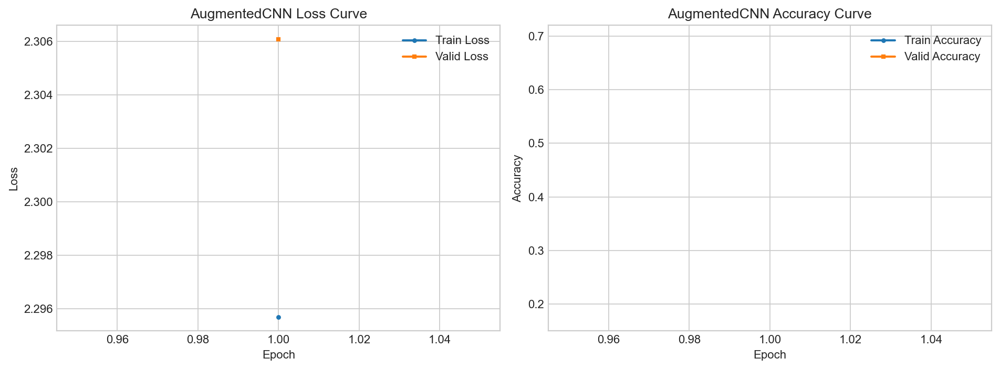

# AugmentedCNN 数据增强实验说明

本文档说明 AugmentedCNN 的设计目的、代码实现方式和实验运行方法。AugmentedCNN 用于研究数据增强对 STL-10 图像分类任务的影响。

## 1. 实验目的

BasicCNN 关注基础卷积神经网络结构本身，而 AugmentedCNN 关注训练数据处理策略。两者使用相同的 CNN 网络骨架，主要区别在于：

```text
BasicCNN:
只使用 Resize、ToTensor、Normalize 等基础预处理。

AugmentedCNN:
在训练阶段额外加入 RandomCrop、RandomHorizontalFlip、ColorJitter 等数据增强。
```

这样设计可以让实验对比更加清晰：如果 AugmentedCNN 的验证集或测试集表现优于 BasicCNN，则可以说明数据增强提升了模型泛化能力。

## 2. 数据增强策略

AugmentedCNN 在训练集上使用如下 transform：

```text
RandomCrop(96, padding=8)
RandomHorizontalFlip()
ColorJitter(brightness=0.15, contrast=0.15, saturation=0.15, hue=0.03)
ToTensor()
Normalize(mean, std)
```

验证集和测试集不使用随机增强，只使用：

```text
Resize((96, 96))
ToTensor()
Normalize(mean, std)
```

这样可以保证验证和测试结果稳定，同时避免把随机增强带入评估过程。

## 3. 各数据增强方法的作用

### 3.1 RandomCrop

`RandomCrop(96, padding=8)` 会先在图像边缘补充像素，再随机裁剪回 `96 x 96`。它可以模拟目标在图像中位置发生轻微偏移的情况，使模型不依赖物体固定出现在图像中央。

### 3.2 RandomHorizontalFlip

`RandomHorizontalFlip` 会以一定概率水平翻转图像。STL-10 中大部分物体类别，如汽车、船、动物等，左右翻转后类别不变，因此该增强方式可以有效扩充训练样本的姿态变化。

### 3.3 ColorJitter

`ColorJitter` 会对亮度、对比度、饱和度和色调进行轻微扰动。它可以模拟不同光照、拍摄条件和颜色变化，减少模型对固定颜色分布的依赖。

## 4. 代码实现方式

代码中通过 `TrainConfig.use_augmentation` 控制是否启用训练增强：

```python
use_augmentation=args.model == "augmented"
```

当命令行参数为 `--model augmented` 时，训练集会启用增强策略；当命令行参数为 `--model basic` 时，只使用基础预处理。

模型注册在 `src/models.py` 中：

```python
class AugmentedCNN(BasicCNN):
    """BasicCNN trained with stronger data augmentation."""
```

这里 AugmentedCNN 继承 BasicCNN，表示它的网络结构与 BasicCNN 相同。这样做的原因是：本实验希望控制变量，只观察数据增强对模型性能的影响。

## 5. 运行命令

训练 AugmentedCNN：

```bash
python main.py --mode train --model augmented --epochs 30 --batch-size 64
```

评估 AugmentedCNN：

```bash
python main.py --mode eval --model augmented
```

绘制训练曲线：

```bash
python scripts/plot_training_curves.py --model augmented
```

训练完成后会生成：

```text
checkpoints/augmented_cnn_best.pt
outputs/logs/augmented_history.csv
outputs/figures/augmented_training_curves.png
```

## 6. 与 BasicCNN 的对比方式

建议在相同训练设置下分别运行：

```bash
python main.py --mode train --model basic --epochs 30 --batch-size 64
python main.py --mode train --model augmented --epochs 30 --batch-size 64
```

然后分别评估：

```bash
python main.py --mode eval --model basic
python main.py --mode eval --model augmented
```

对比时重点关注：

```text
1. 验证集 accuracy 是否提升
2. 测试集 accuracy 是否提升
3. 训练集和验证集之间的差距是否缩小
4. 验证 loss 是否更加稳定
5. 混淆矩阵中容易混淆的类别是否有所改善
```

如果 AugmentedCNN 的训练准确率低于 BasicCNN，但验证或测试准确率更高，这是正常且积极的现象。因为数据增强会让训练样本更难，短期内可能降低训练集准确率，但通常能提升模型对未见样本的泛化能力。

## 7. 报告中可使用的表述

可以在报告中这样描述：

```text
为了提升模型的泛化能力，本文在 BasicCNN 的基础上设计了 AugmentedCNN。该模型保持网络结构不变，仅在训练阶段加入 RandomCrop、RandomHorizontalFlip 和 ColorJitter 等数据增强方法。通过控制网络结构一致，可以更直接地分析数据增强对分类性能的影响。

RandomCrop 用于模拟目标位置偏移，RandomHorizontalFlip 用于扩充左右方向的姿态变化，ColorJitter 用于增强模型对光照和颜色变化的鲁棒性。验证集和测试集不使用随机增强，以保证评估结果的稳定性。
```

## 8. 当前 AugmentedCNN 训练曲线记录与分析

本次实验将训练轮数设置为 `30`，训练日志和曲线图保存在：

```text
outputs/logs/augmented_history.csv
outputs/figures/augmented_training_curves.png
```

对应训练曲线如下：



根据当前日志，可以得到以下关键结果：

```text
第 1 轮:
train_loss = 1.9466, train_accuracy = 0.2247
valid_loss = 1.6824, valid_accuracy = 0.2990

第 30 轮:
train_loss = 0.9916, train_accuracy = 0.6261
valid_loss = 0.9594, valid_accuracy = 0.6562

验证集最高准确率:
valid_accuracy = 0.6648, epoch = 26
```

从训练曲线可以观察到以下现象：

1. 训练集 loss 与验证集 loss 整体都在下降，说明模型已经能够稳定学习到 STL-10 的类别特征。
2. 训练集准确率从约 `22.47%` 提升到约 `62.61%`，验证集准确率从约 `29.90%` 提升到约 `65.62%`，表明增强后的模型具备较好的泛化能力。
3. 与 BasicCNN 相比，AugmentedCNN 的训练准确率更低、验证曲线波动略大，这是因为 `RandomCrop`、`RandomHorizontalFlip` 和 `ColorJitter` 提高了训练样本难度，使模型在训练阶段更难取得高准确率。
4. 在第 `20` 到 `30` 轮之间，验证集准确率基本稳定在 `64%` 到 `66.5%` 之间，没有出现持续下滑，因此当前实验中 **没有明显过拟合**。
5. 验证集准确率长期高于训练集准确率，这也是合理现象：训练阶段启用了随机增强且模型处于 Dropout 开启状态，而验证阶段不使用随机增强、Dropout 也关闭，因此验证样本相对更容易。

综合来看，当前 AugmentedCNN 已经稳定收敛，但在 `30` 轮训练设置下，增强策略带来的收益并没有明显超过 BasicCNN，说明当前增强强度与训练轮数的组合仍有进一步优化空间。

## 9. 当前 AugmentedCNN 测试结果与分析

模型训练完成后，代码会保存验证集准确率最高的 checkpoint：

```text
checkpoints/augmented_cnn_best.pt
```

测试阶段使用如下命令加载最佳模型，并在 `STL10/test` 上进行评估：

```bash
python main.py --mode eval --model augmented
```

本次测试结果如下：

```text
Test loss: 0.9769
Test accuracy: 0.6410
Macro precision: 0.6497
Macro recall: 0.6410
Macro F1: 0.6389
```

混淆矩阵如下，行表示真实类别，列表示预测类别：

```text
[[85  5  0  0  1  0  1  1  3  4]
 [ 6 55  0 14  6  6  0 13  0  0]
 [ 4  0 74  1  1  2  4  0  4 10]
 [ 0  8  0 44  6  8  2 30  2  0]
 [ 1  4  2  6 69  7  4  7  0  0]
 [ 0  4  0  3 15 23 12 43  0  0]
 [ 1  3  0  0 10 10 70  6  0  0]
 [ 0  2  0 12  6 11  0 69  0  0]
 [11  5  2  0  0  0  0  0 76  6]
 [ 2  1 14  1  1  1  0  0  4 76]]
```

从测试结果可以看出：

1. 测试集准确率为 `64.10%`，与验证集最高准确率 `66.48%` 比较接近，说明验证集结果能够基本反映模型在未见样本上的性能。
2. AugmentedCNN 对部分类别仍保持较好的识别能力，例如 `airplane=85/100`、`car=74/100`、`ship=76/100`、`truck=76/100`。
3. 动物类别仍然是主要难点，尤其是 `dog` 类别仅正确识别 `23/100`，并且大量被误判为 `monkey`（`43` 次）；`cat` 也有 `30` 次被预测为 `monkey`。
4. 这说明数据增强提升了模型对部分姿态和颜色变化的鲁棒性，但对于外观相近、细粒度差异较小的动物类别，当前网络深度和特征表达能力仍然有限。

## 10. 与 BasicCNN 的实验结果对比

在当前项目实现和相同 `30` 轮训练设置下，BasicCNN 与 AugmentedCNN 的关键结果如下：

| 指标 | BasicCNN | AugmentedCNN | 对比结论 |
| --- | --- | --- | --- |
| 第 30 轮 train accuracy | 65.33% | 62.61% | AugmentedCNN 更低，说明训练样本更难 |
| 最佳 valid accuracy | 66.76%（第 30 轮） | 66.48%（第 26 轮） | BasicCNN 略高 `0.28` 个百分点 |
| 第 30 轮 valid accuracy | 66.76% | 65.62% | BasicCNN 略高 |
| Test accuracy | 65.00% | 64.10% | BasicCNN 略高 `0.90` 个百分点 |
| Test loss | 0.9537 | 0.9769 | BasicCNN 更低 |
| Macro F1 | 64.85% | 63.89% | BasicCNN 略优 |

从对比结果可以得到以下结论：

1. **当前这组实验中，数据增强没有带来最终精度提升。** 无论是最佳验证集准确率还是测试集准确率，AugmentedCNN 都略低于 BasicCNN。
2. **数据增强确实提高了训练难度。** AugmentedCNN 的训练准确率明显低于 BasicCNN，但验证准确率与其接近，说明增强策略起到了正则化作用，只是当前收益还不足以转化为更高的最终测试精度。
3. **不同类别受到增强的影响并不一致。** AugmentedCNN 在 `airplane`、`bird`、`horse`、`monkey`、`truck` 等类别上有小幅改善，但在 `car`、`deer`、`dog`、`ship` 等类别上略有下降，因此整体平均指标没有超过 BasicCNN。
4. **当前实验结果仍然具有分析价值。** 在课程项目中，实验结论不一定必须是“增强后更好”。当前结果表明：在固定网络结构和 `30` 轮训练设置下，直接加入较强的数据增强并不一定立即提升性能，说明增强策略、训练轮数和优化参数之间需要协同调整。

如果后续继续优化 AugmentedCNN，可以尝试以下方向：

```text
1. 将训练轮数增加到 40~60 轮，让模型有更充分时间适应增强后的样本分布
2. 适当减弱 ColorJitter 强度，避免颜色扰动过大影响类别判别
3. 保留 RandomCrop 和 RandomHorizontalFlip，分组比较不同增强组合的效果
4. 调整学习率或加入 warmup，使增强条件下的训练更平稳
```
