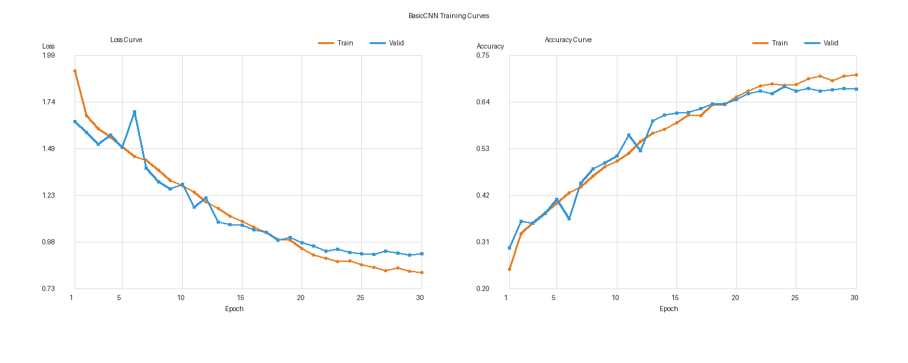

# BasicCNN 网络结构与代码设计说明

本文档用于说明本项目中 BasicCNN 图像分类流程的设计思路，便于后续撰写实验报告。

## 1. 任务目标

本项目使用 STL-10 数据集完成 10 类图像分类任务。数据集中的图像为 RGB 彩色图像，尺寸为 `96 x 96`，类别包括：

```text
airplane, bird, car, cat, deer, dog, horse, monkey, ship, truck
```

模型输入为一张 STL-10 图像，输出为 10 个类别对应的 logits，训练时使用交叉熵损失函数进行监督学习。

## 2. 整体代码结构

项目将数据读取、模型定义、训练评估和命令行入口拆分到不同文件中，便于维护和实验扩展。

```text
src/
|-- config.py     # 统一管理路径、类别、训练超参数
|-- dataset.py    # 读取 STL10 文件夹数据，构造 train/valid/test DataLoader
|-- models.py     # 定义 BasicCNN 网络结构
|-- train.py      # 训练、验证、测试评估、保存模型
main.py           # 命令行入口
```

这种设计的好处是：模型结构和训练流程相互独立，后续如果要加入 ImprovedCNN、ResNet 或更多实验，只需要在 `models.py` 中增加模型，并在训练入口中选择即可。

## 3. 数据读取与预处理设计

数据集按如下目录组织：

```text
STL10/
|-- train/
|   |-- airplane/
|   |-- bird/
|   `-- ...
`-- test/
    |-- airplane/
    |-- bird/
    `-- ...
```

`dataset.py` 中实现了 `STL10FolderDataset`，它会按照固定类别顺序遍历每个类别文件夹，并为每张图片分配对应标签。固定类别顺序可以保证训练、验证和测试阶段的标签含义一致。

训练集会从 `STL10/train` 中划分出一部分作为验证集，默认验证集比例为 `0.15`。代码中分别构造了训练集和验证集两个 Dataset 对象，避免训练数据增强影响验证集。

训练阶段对 BasicCNN 使用的预处理为：

```text
Resize((96, 96))
ToTensor()
Normalize(mean, std)
```

也就是说，当前代码中的 BasicCNN **不使用** `RandomCrop`、`RandomHorizontalFlip` 或 `ColorJitter` 等随机数据增强，而是作为一个不带额外增强的基础 CNN baseline。验证集和测试集同样只进行尺寸统一和标准化，以保证评估结果稳定。

## 4. BasicCNN 网络结构

BasicCNN 是一个针对 STL-10 的轻量卷积神经网络。由于 STL-10 图像尺寸为 `96 x 96`，网络通过多层卷积提取局部纹理、边缘、形状等特征，并通过池化逐步降低空间分辨率。

整体结构如下：

```text
Input: 3 x 96 x 96

ConvBlock 1: 3   -> 32   96 x 96 -> 48 x 48
ConvBlock 2: 32  -> 64   48 x 48 -> 24 x 24
ConvBlock 3: 64  -> 128  24 x 24 -> 12 x 12
ConvBlock 4: 128 -> 256  12 x 12 -> 6 x 6

AdaptiveAvgPool2d: 256 x 6 x 6 -> 256 x 1 x 1
Flatten: 256
Linear: 256 -> 128
ReLU
Dropout
Linear: 128 -> 10
```

每个 `ConvBlock` 内部结构为：

```text
Conv2d
BatchNorm2d
ReLU
Conv2d
BatchNorm2d
ReLU
MaxPool2d
Dropout2d
```

### 4.1 卷积层设计

卷积核大小使用 `3 x 3`，padding 设置为 `1`，这样卷积操作本身不会改变特征图尺寸。`3 x 3` 卷积是图像分类中常用的基础设计，既能提取局部空间特征，又不会引入过多参数。

每个卷积块中连续使用两层卷积，可以在同一尺度下增强特征表达能力。随着网络加深，通道数从 `32` 逐步增加到 `256`，使模型能够从低级纹理逐渐学习到更高级的语义特征。

### 4.2 Batch Normalization

每个卷积层后使用 `BatchNorm2d`。它可以稳定中间特征分布，使训练过程更平稳，同时允许模型使用相对较大的学习率。对于从零训练的 CNN，BatchNorm 通常能改善收敛速度和最终效果。

### 4.3 ReLU 激活函数

模型采用 `ReLU` 作为非线性激活函数。ReLU 计算简单，能够缓解梯度消失问题，是 CNN 中常用的基础激活函数。

### 4.4 Max Pooling

每个卷积块末尾使用 `MaxPool2d(kernel_size=2)`，将特征图长宽减半。对于 `96 x 96` 输入，经过 4 次池化后空间尺寸变为 `6 x 6`。这种设计可以逐步扩大感受野，同时降低计算量。

### 4.5 Dropout

卷积块中使用 `Dropout2d`，分类器中使用普通 `Dropout`。Dropout 可以随机屏蔽部分特征，减少模型对训练样本的记忆，提高泛化能力。

### 4.6 Adaptive Average Pooling

分类头前使用 `AdaptiveAvgPool2d((1, 1))`，将 `256 x 6 x 6` 的特征图压缩为 `256 x 1 x 1`。这种设计减少了全连接层参数量，也让模型对输入特征图尺寸更稳定。

## 5. 训练流程设计

训练入口在 `main.py` 中，通过命令行参数控制训练或评估：

```bash
python main.py --mode train --model basic
python main.py --mode eval --model basic
```

训练流程主要包括：

```text
1. 设置随机种子，保证实验可复现
2. 构造 train/valid/test DataLoader
3. 创建 BasicCNN 模型
4. 使用 CrossEntropyLoss 作为分类损失
5. 使用 AdamW 优化器更新参数
6. 使用 CosineAnnealingLR 调整学习率
7. 每个 epoch 后在验证集上评估
8. 保存验证集准确率最高的模型
9. 将训练曲线数据保存到 outputs/logs/basic_history.csv
```

优化器选择 `AdamW`，它相比普通 Adam 更好地处理权重衰减，常用于深度学习模型训练。学习率调度器使用 `CosineAnnealingLR`，使学习率在训练过程中逐渐减小，有助于后期模型收敛。

## 6. 评估指标

测试阶段会输出以下指标：

```text
Loss
Accuracy
Macro Precision
Macro Recall
Macro F1-score
Confusion Matrix
```

其中 Accuracy 反映整体分类正确率，Precision/Recall/F1 使用 macro 平均，可以更均衡地观察各类别表现，避免只看整体准确率时忽略类别间差异。

混淆矩阵的行表示真实类别，列表示预测类别。通过混淆矩阵可以分析哪些类别容易被模型混淆，例如动物类之间、交通工具类之间是否存在误判。

## 7. 当前 BasicCNN 的定位

BasicCNN 的目标不是追求最高精度，而是作为一个结构清晰、可解释、容易扩展的基础 CNN baseline。它可以用于完成以下实验目的：

```text
1. 验证 CNN 能够在 STL-10 上有效学习图像特征
2. 为后续数据增强、Dropout、BatchNorm、池化方式等实验提供基准
3. 为 Grad-CAM 可视化提供可解释的卷积特征层
4. 与更复杂模型，如 ResNet、VGG 风格网络进行对比
```

从目前训练日志看，BasicCNN 的训练 loss 和验证 loss 均呈下降趋势，验证准确率最高达到约 `67.33%`，说明该网络已经有效学习到 STL-10 的类别特征，并且具备较稳定的泛化能力。因此它可以作为课程项目中的基础模型结果。

## 8. 可改进方向

如果希望进一步提升性能，可以从以下方向扩展：

```text
1. 增加训练轮数，例如训练 40 到 60 个 epoch
2. 增大网络宽度，例如通道数改为 64, 128, 256, 512
3. 加入更多数据增强，例如 ColorJitter、RandomRotation
4. 尝试不同池化方式，例如 Average Pooling
5. 对比不同激活函数，例如 ReLU、Sigmoid、Tanh
6. 使用 ResNet18 等成熟 CNN 结构进行对比实验
7. 加入 Grad-CAM 可视化，分析模型关注区域
```

这些方向也正好对应课程项目中关于模型结构、数据增强、正则化和可解释性的实验要求。

## 9. 训练曲线记录与分析

本次将训练轮数设置为 `30`，训练日志保存在：

```text
outputs/logs/basic_history.csv
```

根据日志绘制了训练集与验证集的 Loss、Accuracy 曲线：



绘图脚本为：

```bash
python scripts/plot_training_curves.py
```

从训练曲线可以观察到：

```text
第 1 轮:
train_loss = 1.9022, train_accuracy = 0.2434
valid_loss = 1.6307, valid_accuracy = 0.2924

第 30 轮:
train_loss = 0.8163, train_accuracy = 0.7024
valid_loss = 0.9158, valid_accuracy = 0.6676

验证集最高准确率:
valid_accuracy = 0.6733, epoch = 24
```

训练过程中，训练集 loss 从约 `1.90` 下降到约 `0.82`，验证集 loss 从约 `1.63` 下降到约 `0.92`。同时，训练集准确率从约 `24.34%` 提升到约 `70.24%`，验证集准确率从约 `29.24%` 提升到约 `66.76%`，说明模型在训练过程中持续学习到了有效的图像分类特征。

从曲线形态看，训练集和验证集的 loss 都整体下降，验证集准确率在第 `20` 轮之后进入相对稳定的平台区，并在第 `24` 轮达到最高值 `67.33%`。后续若干轮中训练准确率继续上升，但验证准确率没有同步明显提升，说明模型后期仍在继续拟合训练集，不过过拟合程度并不严重。

由于当前 BasicCNN 训练阶段不使用随机数据增强，而模型内部仍含有 BatchNorm 与 Dropout，因此后期出现了大约 `3` 到 `4` 个百分点的训练集与验证集准确率差距。这表明模型已经进入较稳定收敛阶段，但如果继续单纯增加训练轮数，收益可能有限。

因此，当前 BasicCNN **总体上没有明显失控的过拟合**，但在训练后期已经出现了一定程度的训练集继续改善而验证集提升放缓的现象。对课程项目而言，这样的结果是合理的，也说明该模型已经可以作为后续增强实验的对照基线。

## 10. 测试结果与分析

模型训练完成后，代码会保存验证集准确率最高的 checkpoint：

```text
checkpoints/basic_cnn_best.pt
```

测试阶段使用如下命令加载最佳模型，并在 `STL10/test` 上进行评估：

```bash
python main.py --mode eval --model basic
```

测试时不使用随机数据增强，只进行图像尺寸统一、张量转换和标准化。这样可以保证测试结果稳定，并且与真实推理场景更一致。

本次测试结果如下：

```text
Test loss: 0.9367
Test accuracy: 0.6580
Macro precision: 0.6599
Macro recall: 0.6580
Macro F1: 0.6558
```

混淆矩阵如下，行表示真实类别，列表示预测类别：

```text
[[85  3  1  1  1  0  1  0  4  4]
 [ 6 58  0 14  4  5  0 13  0  0]
 [ 1  0 77  2  0  0  2  0  9  9]
 [ 0 10  0 59  4  7  2 15  3  0]
 [ 1  5  2  6 65  8  5  8  0  0]
 [ 0  7  0  5  9 26 14 39  0  0]
 [ 1  2  0  2  7 13 71  4  0  0]
 [ 0  6  0 15  9  9  1 60  0  0]
 [ 5  2  2  2  0  0  0  0 85  4]
 [ 1  0 15  2  1  0  1  0  8 72]]
```

从结果看，测试集准确率为 `65.80%`，与验证集最高准确率 `67.33%` 较为接近，说明验证集能够较好反映模型在未见数据上的表现，整体泛化能力较稳定。

从混淆矩阵看，模型对部分交通工具类别识别较好，例如：

```text
airplane: 85 / 100
car:      77 / 100
ship:     85 / 100
truck:    72 / 100
```

同时，部分动物类别和相似外观类别仍然较容易混淆，尤其是：

```text
dog 被预测为 monkey: 39 次
cat 被预测为 monkey: 15 次
monkey 被预测为 cat: 15 次
horse 被预测为 dog:  13 次
truck 被预测为 car:  15 次
```

这说明 BasicCNN 已经能够较好地区分大类外观差异明显的目标，但对动物类内部的细粒度差异、姿态变化和局部纹理特征仍然不够敏感。因此，如果后续要继续提升结果，可以优先考虑更强的数据增强、更深的网络结构，或引入预训练模型来增强特征表达能力。

## 11. 评价指标说明

本项目使用以下指标评价分类模型性能：

### 11.1 Loss

Loss 使用交叉熵损失函数计算，反映模型预测分布与真实标签之间的差异。Loss 越低，说明模型对真实类别的预测置信度整体越高。训练 loss 可以反映模型对训练数据的拟合情况，验证 loss 和测试 loss 则更能反映泛化能力。

### 11.2 Accuracy

Accuracy 表示预测正确的样本数占总样本数的比例：

```text
Accuracy = 正确预测样本数 / 总样本数
```

它是最直观的分类性能指标。本次测试集 accuracy 为 `65.00%`，说明模型在 10 类 STL-10 测试图像中能够正确分类约三分之二的样本。

### 11.3 Precision

Precision 表示模型预测为某一类的样本中，真正属于该类的比例：

```text
Precision = TP / (TP + FP)
```

Precision 越高，说明模型对该类别的预测越可靠。本项目使用 Macro Precision，即先分别计算每个类别的 Precision，再对所有类别取平均。本次 Macro Precision 为 `65.83%`。

### 11.4 Recall

Recall 表示某一真实类别中，被模型正确找出的比例：

```text
Recall = TP / (TP + FN)
```

Recall 越高，说明模型漏判该类别的情况越少。本项目使用 Macro Recall，对每个类别的 Recall 取平均。本次 Macro Recall 为 `65.00%`。

### 11.5 F1-score

F1-score 是 Precision 和 Recall 的调和平均：

```text
F1 = 2 * Precision * Recall / (Precision + Recall)
```

当 Precision 和 Recall 都较高时，F1-score 才会较高，因此它能更综合地反映分类效果。本次 Macro F1-score 为 `64.85%`，与 Accuracy 接近，说明整体性能比较均衡，没有极端依赖某一个指标。

### 11.6 Confusion Matrix

混淆矩阵用于分析每个类别之间的具体误分类情况。矩阵中第 `i` 行第 `j` 列表示真实类别为 `i` 的样本被预测为 `j` 的数量。通过混淆矩阵可以发现模型容易混淆的类别，为后续改进提供依据。

本次实验中，混淆矩阵显示模型对飞机、汽车、船、卡车等类别识别效果较好，但对猫、狗、猴子、马、鹿等动物类别存在较多混淆。因此后续可以通过更强的数据增强、更深的网络结构或预训练模型来提升动物细粒度特征的表达能力。
