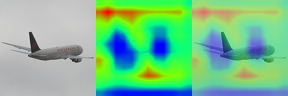

# Grad-CAM 可视化说明与结果分析

本文档说明本项目中 Grad-CAM 可视化方法的设计目的、实现方式、运行命令以及当前生成的示例结果。Grad-CAM 用于解释 CNN 模型在进行图像分类时主要关注了图像中的哪些区域，从而帮助分析模型捕捉到的图像特征和决策过程。

## 1. 方法目的

在 STL-10 图像分类任务中，Accuracy、Precision、Recall、F1-score 和混淆矩阵可以反映模型整体分类效果，但这些指标不能直接说明模型为什么做出某个预测。

Grad-CAM 的作用是：

```text
1. 可视化模型对某个类别预测时关注的图像区域
2. 判断模型是否真正关注目标主体，而不是背景或无关区域
3. 对比正确分类和错误分类样本中的关注区域差异
4. 辅助解释模型在动物类、交通工具类等类别上的分类行为
```

因此，Grad-CAM 可以作为课程项目中“模型可解释性分析”的重要补充。

## 2. Grad-CAM 基本原理

Grad-CAM 的全称是 Gradient-weighted Class Activation Mapping。它通过目标类别对最后一层卷积特征图的梯度，计算不同通道对该类别的重要性。

基本流程如下：

```text
1. 输入一张图像，进行模型前向传播，得到分类 logits
2. 选择一个目标类别，可以是模型预测类别，也可以手动指定类别
3. 对目标类别得分进行反向传播，得到该类别相对于最后一层卷积特征图的梯度
4. 对每个通道的梯度做全局平均池化，得到通道权重
5. 用通道权重对卷积特征图加权求和
6. 经过 ReLU 得到只对目标类别有正向贡献的区域
7. 将热力图上采样到输入图像大小，并叠加到原图上
```

如果热力图主要覆盖物体主体，说明模型的预测较多依赖目标本身；如果热力图集中在背景或无关区域，则说明模型可能受到了错误线索干扰。

## 3. 与 CAM 的区别

CAM 和 Grad-CAM 都可以生成类别激活热力图，但二者适用范围不同：

```text
CAM:
需要网络结构满足 Global Average Pooling + Linear 分类器等特定形式。
如果模型结构不满足，通常需要修改网络并重新训练。

Grad-CAM:
通过梯度计算通道权重，不强制要求特定分类头结构。
可以直接用于当前已经训练好的 BasicCNN、AugmentedCNN 和 ImprovedCNN。
```

本项目已经完成多个模型训练，因此选择 Grad-CAM 更合适，不需要为了可视化重新修改网络结构或重新训练。

## 4. 代码实现方式

Grad-CAM 相关代码位于：

```text
src/gradcam.py
```

命令行入口仍然使用：

```text
main.py
```

当前新增了运行模式：

```bash
--mode gradcam
```

Grad-CAM 使用的目标卷积层为最后一个卷积块中的第二个卷积层：

```text
model.features[3].block[3]
```

该层适用于：

```text
BasicCNN
AugmentedCNN
ImprovedCNN
```

选择最后一层卷积特征图的原因是：它同时保留一定空间位置信息，又包含较高级的语义特征，适合用于解释分类决策。

## 5. 运行命令

### 5.1 BasicCNN 示例

```bash
python main.py --mode gradcam --model basic --split test --sample-index 0 --device cpu
```

### 5.2 AugmentedCNN 示例

```bash
python main.py --mode gradcam --model augmented --split test --sample-index 0 --device cpu
```

### 5.3 ImprovedCNN 示例

如果使用当前最佳 ImprovedCNN 配置：

```text
activation = relu
pooling = avg
normalization = none
```

运行命令为：

```bash
python main.py --mode gradcam --model improved --activation relu --pooling avg --normalization none --split test --sample-index 0 --device cpu
```

### 5.4 选择指定类别样本

可以通过 `--class-name` 先选择类别，再用 `--sample-index` 选择该类别下的第几个样本：

```bash
python main.py --mode gradcam --model basic --split test --class-name airplane --sample-index 1 --device cpu
```

### 5.5 指定解释目标类别

默认情况下，Grad-CAM 会解释模型的预测类别。如果希望解释某个指定类别，可以使用 `--target-class`：

```bash
python main.py --mode gradcam --model basic --split test --sample-index 0 --target-class airplane --device cpu
```

这可以用于分析：即使模型预测错误，模型对真实类别的响应区域在哪里。

## 6. 输出文件说明

Grad-CAM 结果保存在：

```text
outputs/gradcam/<run_name>/
```

其中 `<run_name>` 与模型配置有关，例如：

```text
basic
augmented
improved_relu_avg_no_bn
```

每次运行会生成以下文件：

```text
*_original.png   # 原始输入图像
*_heatmap.png    # Grad-CAM 热力图
*_overlay.png    # 热力图叠加到原图后的结果
*_panel.png      # 原图、热力图、叠加图组成的三联图
*_meta.json      # 模型、预测类别、目标类别、置信度等元信息
```

其中最适合放入报告的是 `*_panel.png`，因为它同时展示了原图、关注区域和叠加效果。

## 7. 当前已生成的示例结果

当前已经生成了 BasicCNN、AugmentedCNN 和 ImprovedCNN 的 Grad-CAM 示例。

### 7.1 错误分类样本：airplane 被误判为其他交通工具

样本路径：

```text
STL10/test/airplane/00059.png
```

真实类别为 `airplane`。不同模型的预测结果如下：

| 模型 | 预测类别 | 预测置信度 | Grad-CAM 目标类别 |
| --- | --- | --- | --- |
| BasicCNN | truck | 0.6997 | truck |
| AugmentedCNN | ship | 0.4799 | ship |
| ImprovedCNN（ReLU + AvgPool + No BatchNorm） | truck | 0.4171 | truck |

对应三联图如下：

BasicCNN：


AugmentedCNN：


ImprovedCNN：


从可视化结果看，这张 airplane 图像中包含明显的海港、船只、建筑和水面背景。模型的热力图并没有稳定集中在飞机主体上，而是较多关注图像中间或右侧的港口、船只和建筑区域。因此模型容易把该图误判为 `ship` 或 `truck` 等交通工具类别。

这说明模型在某些复杂背景图像中可能会利用背景共现信息进行判断，而不是完全依赖目标主体本身。该现象也解释了混淆矩阵中交通工具类别之间仍存在误判的原因。

### 7.2 正确分类样本：airplane 被正确识别

样本路径：

```text
STL10/test/airplane/00060.png
```

真实类别为 `airplane`。不同模型的预测结果如下：

| 模型 | 预测类别 | 预测置信度 | Grad-CAM 目标类别 |
| --- | --- | --- | --- |
| BasicCNN | airplane | 0.9342 | airplane |
| AugmentedCNN | airplane | 0.9552 | airplane |
| ImprovedCNN（ReLU + AvgPool + No BatchNorm） | airplane | 0.9546 | airplane |

对应三联图如下：

BasicCNN：



AugmentedCNN：


ImprovedCNN：


这组样本中，三个模型都能以较高置信度预测为 `airplane`。与错误分类样本相比，正确样本的 Grad-CAM 更适合用于观察模型在成功分类时是否关注飞机主体区域。

如果热力图主要覆盖飞机机身、机翼或天空中的目标区域，可以说明模型确实学习到了与飞机类别相关的视觉特征；如果热力图仍然集中在背景上，则说明模型虽然预测正确，但可能依赖了背景线索。

## 8. 对模型决策过程的解释

结合当前两组样本，可以得到以下分析：

1. **模型确实能够学习类别相关的局部特征。** 在正确分类样本中，模型对 `airplane` 类别给出了较高置信度，说明卷积特征能够支持该类别判断。
2. **复杂背景会干扰模型判断。** 错误分类样本中包含大量港口、水面、船只或建筑等背景元素，Grad-CAM 显示模型关注区域容易偏向这些位置，导致 airplane 被误判为 ship 或 truck。
3. **Grad-CAM 可以帮助解释混淆矩阵中的误判。** 仅从混淆矩阵可以看到 airplane、ship、truck 等交通工具之间存在混淆，而 Grad-CAM 进一步说明这些混淆可能来自模型对背景和局部物体线索的依赖。
4. **不同模型的关注区域存在差异。** BasicCNN、AugmentedCNN 和 ImprovedCNN 在同一张图上的预测类别和置信度不同，说明数据增强和结构调整会改变模型内部特征表达方式。

## 9. 报告中可使用的表述

可以在报告中这样描述：

```text
为了进一步分析 CNN 模型的可解释性，本文采用 Grad-CAM 方法对模型的分类决策过程进行可视化。Grad-CAM 通过计算目标类别相对于最后一层卷积特征图的梯度，得到不同通道对该类别的重要性权重，并生成类别激活热力图。热力图中响应较强的区域表示模型在做出该类别预测时更关注的图像位置。

在实验中，本文分别对正确分类和错误分类样本进行了可视化分析。对于正确分类样本，Grad-CAM 可用于判断模型是否关注目标主体区域；对于错误分类样本，Grad-CAM 可以帮助发现模型是否受到背景、相似物体或局部纹理的干扰。实验结果表明，模型在部分复杂背景图像中会关注港口、船只、建筑等区域，从而导致 airplane 被误判为 ship 或 truck。这说明模型的决策不仅依赖目标本身，也可能受到背景共现信息影响。
```

## 10. 后续可扩展方向

后续如果要进一步完善可解释性实验，可以尝试：

```text
1. 每个类别选择 1~2 张正确分类样本生成 Grad-CAM
2. 每个模型选择若干错误分类样本进行对比
3. 对同一张图分别解释预测类别和真实类别
4. 将 Grad-CAM 结果与混淆矩阵中高频误判类别结合分析
5. 比较 BasicCNN、AugmentedCNN 和 ImprovedCNN 在相同样本上的关注区域差异
```

这样可以让可解释性分析更加系统，也更容易支撑课程报告中关于模型决策过程的讨论。
